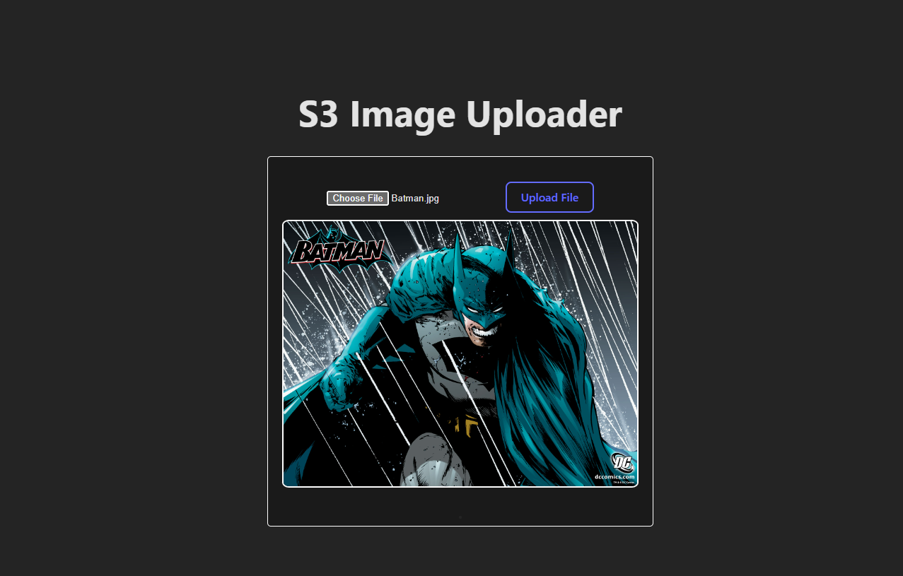

# S3 Image Uploader

This project is a simple frontend and backend system that enables users to upload images to an Amazon S3 bucket. The frontend is a React application, while the backend is an AWS Lambda function triggered by API Gateway.

## Frontend


The frontend provides a user-friendly interface for selecting and uploading images. Users can select an image file from their local system and click the "Upload File" button to send it to the S3 bucket.

## OpenAPI Specification

## Backend

The backend is a serverless function built using AWS Lambda and the AWS SDK for JavaScript. It receives the image data from the frontend and uploads it to the specified S3 bucket. The function is triggered by an HTTP POST request sent from the frontend.

### API Endpoint

- **POST** `/upload`: Upload an image file to the S3 bucket.

### Request Headers

- `X-Filename`: Name of the file being uploaded.

### Responses

- **200**: Image uploaded successfully.

  ```json
  { "message": "Image uploaded successfully" }
  ```

- **500**: Internal Server Error
  ```json
  { "message": "Internal Server Error" }
  ```
